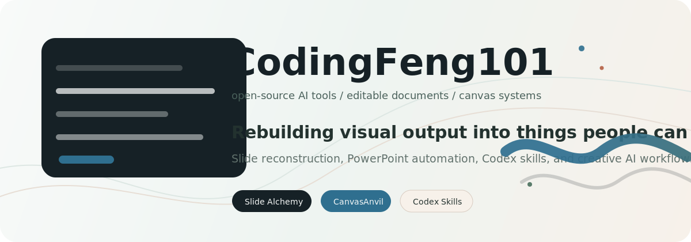
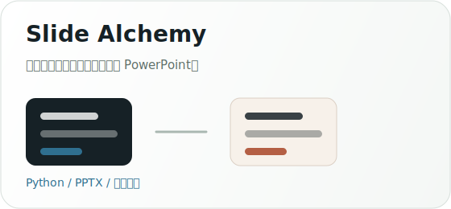
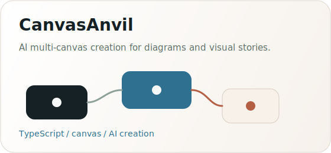
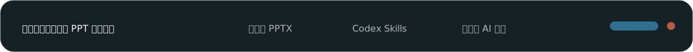

<div align="center">
  
</div>

<br />

<table>
  <tr>
    <td width="58%" valign="top">

### I build tools that turn messy creative work into editable systems.

I am **fengguodong**, also known as **CodingFeng101**. I work on open-source AI tooling, slide reconstruction, and multi-canvas creation workflows.

My current focus is the space between visual documents and structured editing:

- **Slide Alchemy** rebuilds screenshots, image-based PPTX files, and scanned decks into more editable PowerPoint files.
- **CanvasAnvil** explores AI-assisted multi-canvas creation for flowcharts, interiors, presentations, posters, infographics, and product storytelling.
- I care about workflows where AI output is not just pretty, but reusable, editable, and practical.

    </td>
    <td width="42%" valign="top">

### Current Orbit

```txt
role        student / builder
location    China
school      Jiangxi Normal University
handle      CodingFeng101
focus       AI tools, PPT reconstruction, canvas systems
```

    </td>
  </tr>
</table>

<br />

## Projects

<table>
  <tr>
    <td width="50%" valign="top">
      <a href="https://github.com/CodingFeng101/slide-alchemy">
        
      </a>
    </td>
    <td width="50%" valign="top">
      <a href="https://github.com/CodingFeng101/CanvasAnvil">
        
      </a>
    </td>
  </tr>
</table>

<br />

## What I Like Building

<table>
  <tr>
    <td width="33%" valign="top">
      <b>Image-first PPT workflows</b>
      <br />
      Turning rendered slides back into editable objects, text boxes, and layout structure.
    </td>
    <td width="33%" valign="top">
      <b>Codex skills</b>
      <br />
      Packaging repeatable AI workflows so people can run them inside real development environments.
    </td>
    <td width="33%" valign="top">
      <b>Creative tooling</b>
      <br />
      Building interfaces and pipelines for design, documents, diagrams, and visual storytelling.
    </td>
  </tr>
</table>

<br />

## Tech Trail

<p>
  
  
  
  
  
</p>

<br />

<div align="center">
  
</div>

