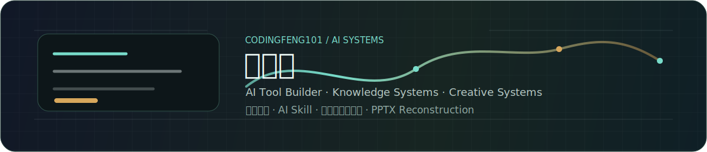

<div align="center">
  
</div>

<br />

# 你好，我是冯国栋

### AI Tool Builder · Knowledge Systems · Creative Systems

我关注如何把知识、内容和想法，变成结构化、可编辑、可使用的 AI 工具。

<p>
  
  
  
  
</p>

---

## 关于我

我是一名计算机科学与技术本科生，目前主要关注 **AI 应用开发、知识图谱、智能体、AI Skill 与可编辑内容生成**。

相比于单纯调用模型，我更感兴趣的是：

- 如何把复杂知识组织成可检索、可推理的结构
- 如何让 AI 生成的 PPT 真正可编辑、可复用
- 如何把大模型能力封装进具体任务流程
- 如何构建能落地到真实场景的 AI 工具

---

## 我关注的两个方向

### Knowledge Systems

我关注知识如何被结构化、检索和推理。

- 知识图谱构建
- 图谱增强问答
- 实体关系组织
- Human-LLM 协同知识建模
- 领域知识结构化与语义检索

### Creative Systems

我关注 AI 如何生成真正可继续编辑和使用的内容。

- PPT 与文档内容重建
- 可编辑 PowerPoint 生成
- 多画布 AI 创作
- AI Skill 任务封装
- 从自然语言到可视化结果的生成流程

---

## 当前探索

- AI Skills for document and slide reconstruction
- Graph-enhanced question answering
- Multi-canvas AI creation workflows
- Human-LLM knowledge modeling
- Editable PPTX generation and reconstruction

---

## 研究与背景

- TKDE 在投：Human-LLM 协同的领域知识图谱构建
- 授权发明专利：知识图谱搜索方法及系统
- 项目方向：知识图谱平台、AI 创作平台、PPT 可编辑化重建
- 实践经历：全栈开发、智能体开发、AI 应用开发

---

## 技术栈

```text
Python · TypeScript · React · Vite · FastAPI · Node.js
MySQL · Neo4j · Docker · Git · LLM · AI Agent · AI Skill
```

---

## 一句话

静态内容不该永远静态，知识也不该只停留在文本里。

我希望构建的 AI 工具，能够理解结构、连接知识，并交付真正可继续使用的结果。

